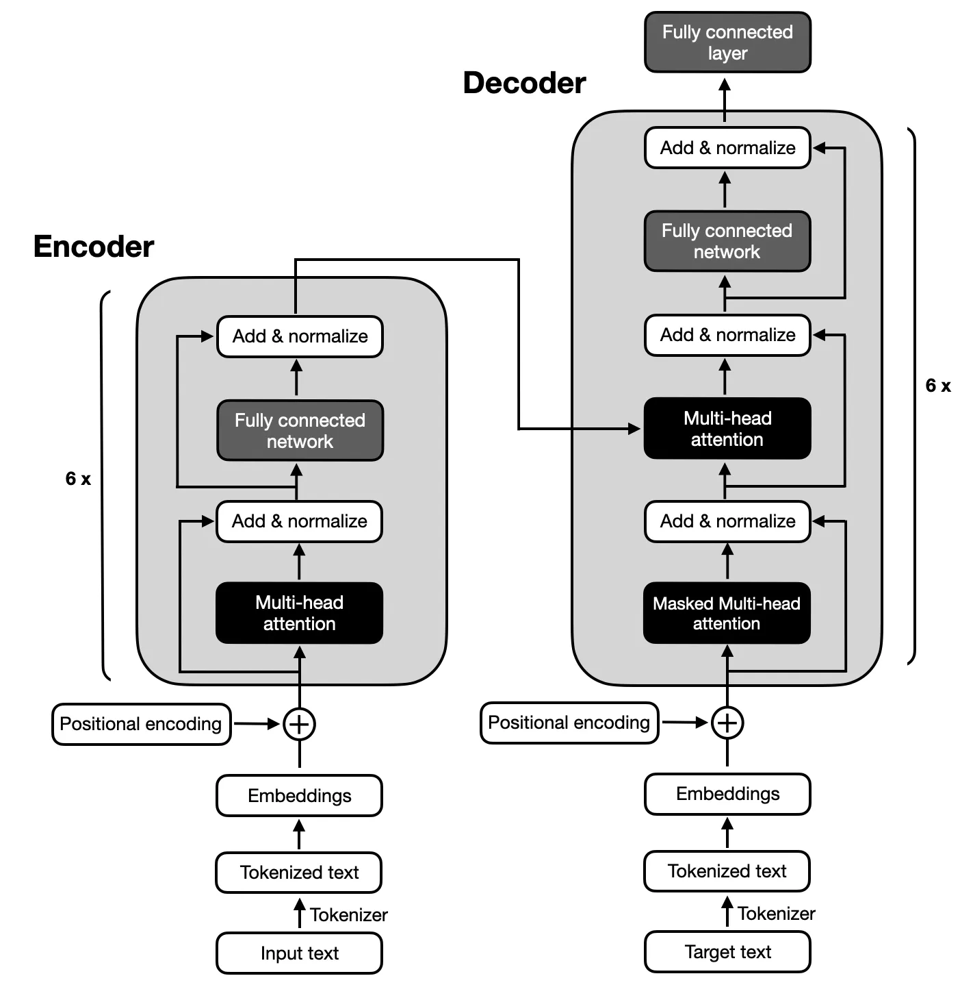

# Bachelor Thesis - Computer Science

## Exploring Open Source Generative AI models for understanding and summarizing documents


[](https://shields.io/)

[](https://colab.research.google.com/github/Naereen/badges)

The purpose of this work is to explore the potential of generative AIs, in particular those based on the Transformer architecture, to automate the process of summarizing and summarizing documents. The main objective is to study and explore existing open source artificial intelligence (AI) models, with a focus on generative AIs, aiming for the ability to perform analysis, understand context and generate summaries for unstructured documents available on the internet.

For this, we will use encoder-decoder models, following the architecture proposed by the original Transformers (image 1), because text summarization requires a complex mapping between input and output sequences and it is crucial to capture the relationships between elements in both sequences. And encoder-decoder models perform better in this task.




## Work Steps

- [ ] Extract text from documents
    - [x] PDF
    - [x] DOCX
    - [ ] PNG / JPEG
- [ ] Preprocess text
    - [x] Normalize sequences length
    - [ ] Tokenizer´s
- [ ] Test with different models
    - [ ] BART
    - [ ] Pegasus
    - [ ] T5
- [ ] Evaluate model performance
    - [ ] rouge score
- [ ] Fine-tune the pretrained model with best performance

## How it Works

> WIP

## How to run

1. You need to have Python V3 installed

2. If you are in MacOs, run the following command

```bash
$ xcode-select --install
$ pip3 install --upgrade pip
$ pip3 install --upgrade setuptools
``````

2. Run the following command

```bash
pip3 install
python3 main.py
```

## How to use this work

> WIP
